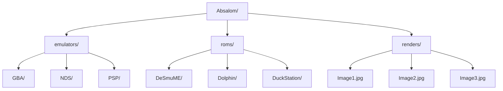

# **Absalom: Makes Emulation Portable**

Absalom is a portable emulator and ROM launcher that is designed to launch ROMs with compatible emulators.. 

**Key Features**

+ 100% Portable: Runs directly without installation perfect for USB drives.
+ Emulators: Add any emulators in the emulators folder
+ ROMS: Add ROMS in respective folders
+ Renders: Add renders in respective folder to have a manual sliodeshow 

**Instructions**

1. Add emulators and ROMS in respective folders .
2. To save space ROMS should be in zip format expect the ones below
3. 3DS and Switch must be in their original format
4. PSP. PS2, PS3 and GameCube must be in iso format
5. Select game and emulator form drop down menu and then assign
6. Select only the emulator and assign   

> 🚀 **Continuous improvement :** An ongoing effort to enhance Balrog.
> 
> 📝 **Usage:** Absalom is for personal use only.
>
> 🆘 **Support:** If you have any issues with Balrog please reach out politely in GitHub Discussions

