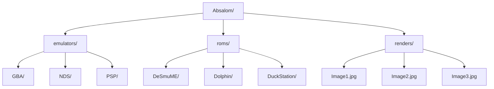

# **Absalom: Emulation Made Portable**

Absalom is a lightweight, portable ROM and emulator manager designed to launch games with compatible emulators seamlessly without requiring installation.

---

**Key Features**

* **100% Portable:** Runs directly without installation—perfect for USB drives.
* **Custom Emulators:** Easily add your preferred emulators to the `emulators/` directory.
* **Organized ROM Management:** Store and sort ROMs inside designated folders.
* **Manual Visual Slideshow:** Add game renders/artwork to display visual media while browsing.

---

**Instructions**

1. Add your emulators and ROMs into their respective folders.
2. To save disk space, ROMs should be compressed in `.zip` format, **except** for the consoles listed below:
   * **3DS & Nintendo Switch:** Must remain in their original formats (e.g., `.3ds`, `.xci`, `.nsp`).
   * **PSP, PS2, PS3 & GameCube:** Must be in `.iso` format.
3. Select a game and an emulator from the drop-down menu, then click **Assign**.
4. To set a default fallback, select only the emulator and click **Assign**. 

---

**Project Guidelines**

> 🚀 **Continuous improvement :** An ongoing effort to enhance Balrog.
> 
> 📝 **Usage:** Absalom is for personal use only.
>
> 🆘 **Help:** If you have any issues with Balrog please reach out politely in GitHub Discussions

---

  <a href="https://github.com/Belthazor86/Valinor/releases#release-Emulators">⬇️ Download</a>
  <a href="https://github.com/sponsors/Belthazor86">💖 Support</a>
  <a href="https://github.com/Belthazor86/Valinor/blob/main/README.md">🏠 Home</a>

### Support Future Releases
If you find this application useful, please consider [sponsoring on GitHub](https://github.com/sponsors/Belthazor86) to support ongoing updates and maintenance!

