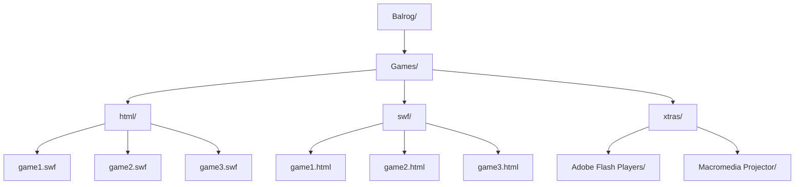

# **Balrog: The Portable Flash & HTML 5 Player**   

Balrog is a portable flash and HTML 5 player that is optimized to play swf and HTML 5 games. 

---

**Key Features**

+ 100% Portable: Runs directly without installation perfect for USB drives.
+ Games: Add flash and HTML 5 games in respective folders
+ Support: Adobe Flash Player and Macromedia Projectors tools 

---

**Instructions**

1. Add flash and HTML 5 games to their respective folders.
2. Scan flash or HTML 5 to display the games.
3. Load flash or HTML 5 games from cloud storage or internal/external storage.
4. Play games with different versions of Adobe Flash Player and Macromedia Projectors 
 
---

---

**Project Guidelines**

> 🚀 **Continuous improvement :** An ongoing effort to enhance Balrog.
> 
> 📝 **Usage:** Balrog is for personal use only.
>
> 🆘 **Help:** If you have any issues with Balrog please reach out politely in GitHub Discussions

  <a href="https://github.com/Belthazor86/Valinor/releases/tag/Flash">⬇️ Download</a>
  <a href="https://github.com/sponsors/Belthazor86">💖 Support</a>
  <a href="https://github.com/Belthazor86/Valinor/blob/main/README.md">🏠 Home</a>

