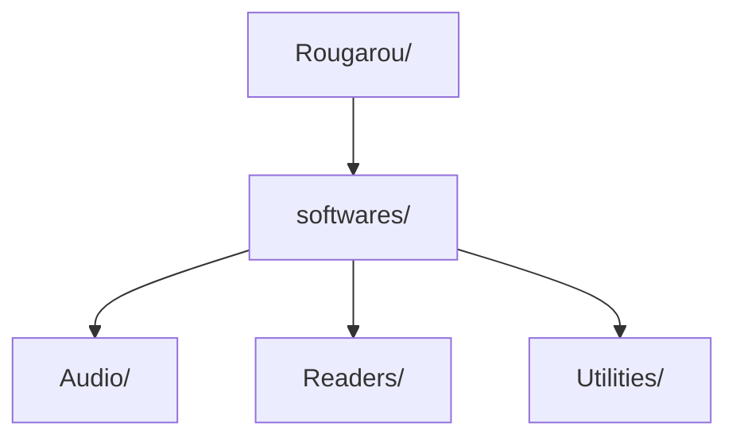

# Rougarou: Archive & Launch Portable Apps

**Rougarou** is a lightweight, portable application launcher designed to organize, archive, and run standalone tools seamlessly without requiring installation.

---

**Key Features**

* **100% Portable:** Runs directly without installation—perfect for USB drives and external storage.
* **Organized Software Management:** Easily store, categorize, and launch portable apps from dedicated folders.

---

**Instructions**

1. Add your portable applications into their respective folders inside the directory.
2. Ensure all portable software packages are compressed in `.zip` format.
3. Select your desired application from the drop-down menu to launch it.

---

---

[Download](https://github.com/Belthazor86/Valinor/releases#release-Software)

---

> 🚀 **Continuous improvement :** An ongoing effort to enhance Balrog.
> 
> 📝 **Usage:** Rougarou is for personal use only.
>
> 🆘 **Support:** If you have any issues with Balrog please reach out politely in GitHub Discussions

