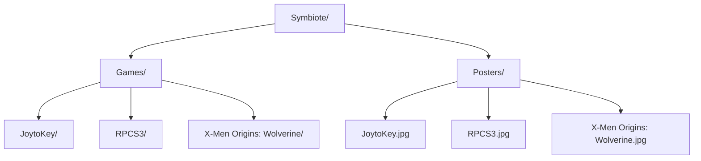

# **Symbiote: The Portable Gaming Launcher**

Symbiote is a portable game launcher where gamers can organize their non-Steam games, emulators, and gaming tools. 

**Key Features**

+ 100% Portable: Runs directly without installation perfect for USB drives.
+ Custom Art: Gamers can add their own customer posters for every item
+ Gamepad Support: Navigate the launcher using the Keyboard or Gamepad
+ Customize: Change the theme of the launcher in the setting folder.

**Instructions**

1. Add games, emulators and gaming tools to games folder
2. Add cover art to posters folder
3. Ensure that the game folder and cover art have the same title
4. Change background an font in settings folder (optional)

[Home](https://github.com/Belthazor86/Valinor) || [Download](https://github.com/Belthazor86/Valinor/releases/tag/Gaming)

> 🚀 **Continuous improvement :** An ongoing effort to enhance the Symbiote.
> 
> 📝 **Usage:** Symbiote is for personal use only.
>
> 🆘 **Support:** If you have any issues with Symbiote please reach out politely in GitHub Discussions

